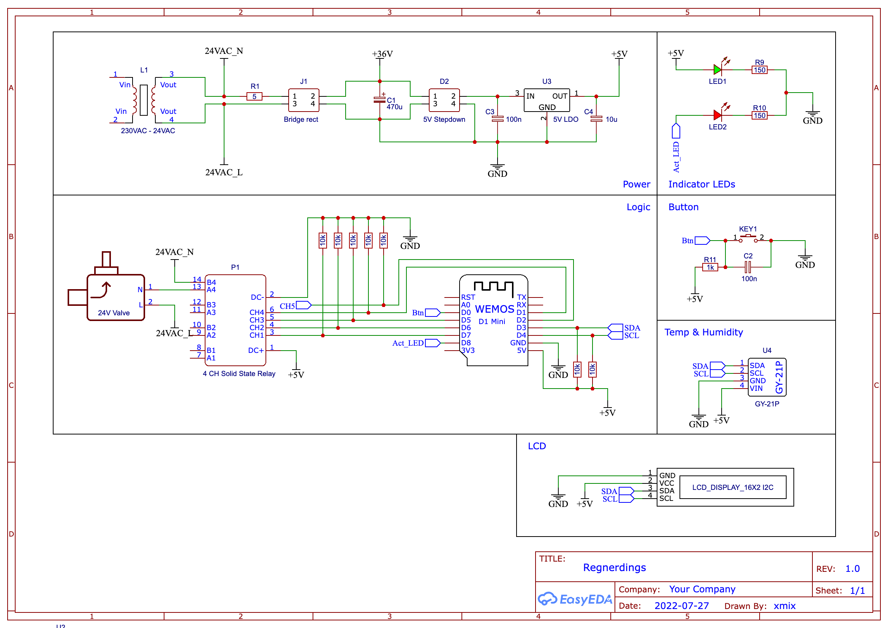

# Regnerdings

## Overview

Input: 230VAC

Trafo: 24VAC

- Strom zu Ventilen
- Über Bridge Rectifier zu µC

5V Chain:

- Buck Converter Modul (https://www.amazon.de/gp/product/B0823P6PW6)
- 5V LDO

2 Stück 4-Fach Relais für 5 Ventile

µC: Wemos D1 mini

- D0: Button
- D1, D2, D5, D6, D7: Relais
- D3, D4: SDA, SCL für
  - 16x2 i2c LCD
  - GY-21 Temp & Luftfeuchte, [Datasheet](docs/GY-21%20Sensor%20Modul%20DE.pdf)
- D8: Activity LED

## OTA Update

Update via the Arduino IDE

- Use <IP Address> as Port
- Use the password that is set in the code

## Schematics

